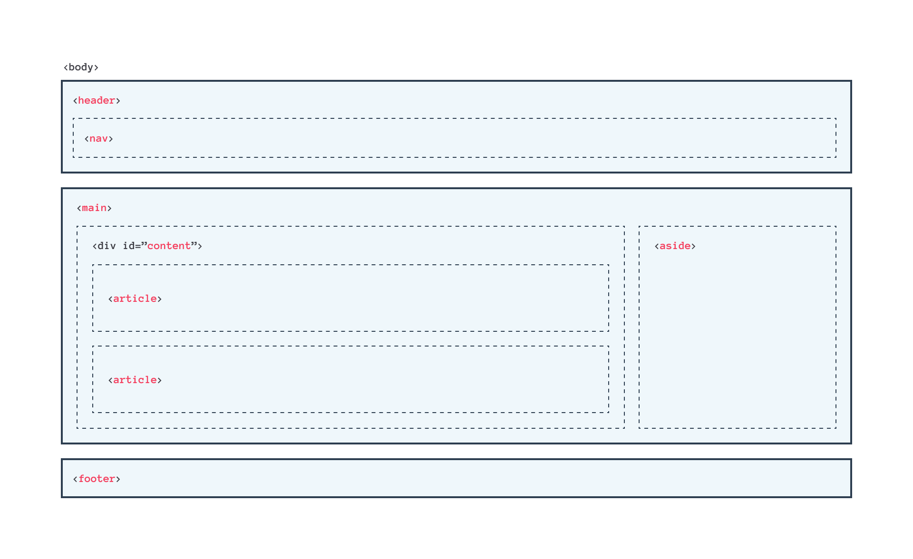

# Submission - Belajar Dasar Pemrograman Web

## Deskripsi Proyek

Proyek ini adalah sebuah website yang dibangun menggunakan HTML semantik dan CSS untuk layout yang responsif. Website ini memenuhi semua kriteria submission yang telah ditentukan, termasuk penggunaan elemen-elemen semantik dan layout yang diatur dengan Flexbox.

## Kriteria Submission

Website ini telah memenuhi kriteria berikut:

- **Struktur HTML Semantik**:
  - Terdapat elemen `<header>`, `<footer>`, `<main>`, `<article>`, dan `<aside>`.
  - Setiap elemen berisi konten yang sesuai dengan fungsinya.
  - Tidak ada duplikasi elemen `<main>`.
  - Elemen `<main>` berada di antara `<header>` dan `<footer>`.

- **Konten Elemen `<aside>`**:
  - Menampilkan foto di elemen `<aside>`, termasuk biodata.

- **Layout Responsif**:
  - Menggunakan Flexbox untuk menyusun layout.

- **Tema**:
  - Tema yang ditampilkan bebas, kecuali tema Bandung.

- **Detail dan Lengkap**:
  - Website dirancang dengan detail dan lengkap untuk meningkatkan nilai submission.

## Sketsa Struktur Website

Berikut adalah sketsa dari struktur website yang digunakan sebagai referensi:
